# AWS CLI Cache - アーキテクチャドキュメント

## 概要

このドキュメントでは、AWS CLI Cacheの内部アーキテクチャ、データフロー、コンポーネント構成をMermaid図を使用して説明します。

---

## システムアーキテクチャ

### 全体構成

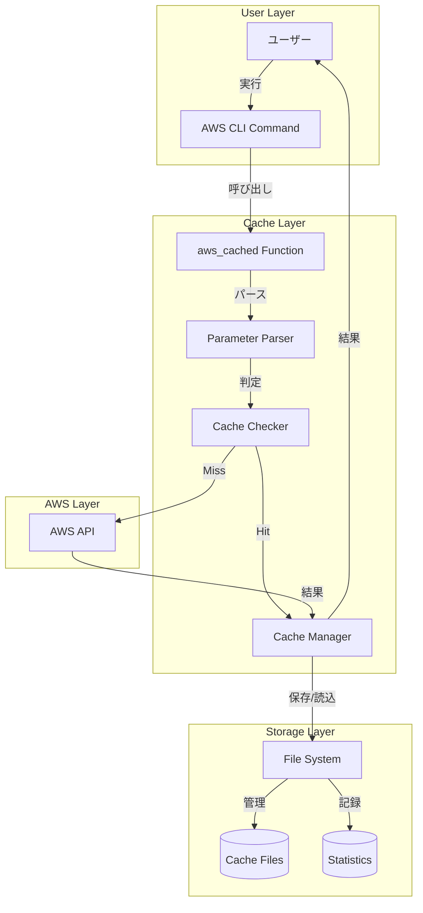

---

## データフロー

### キャッシュヒット時のフロー

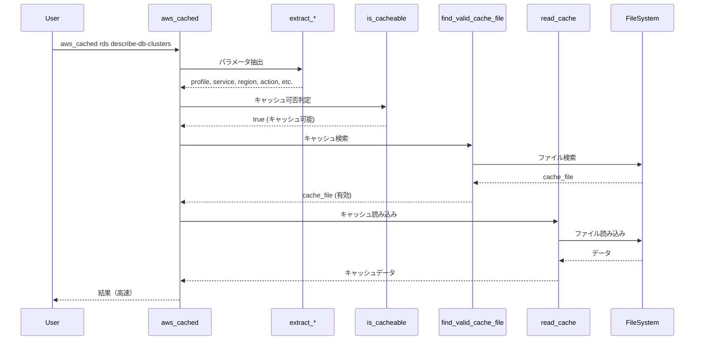

### キャッシュミス時のフロー

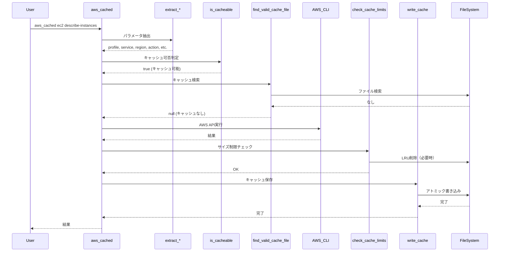

---

## コンポーネント構成

### 主要コンポーネント

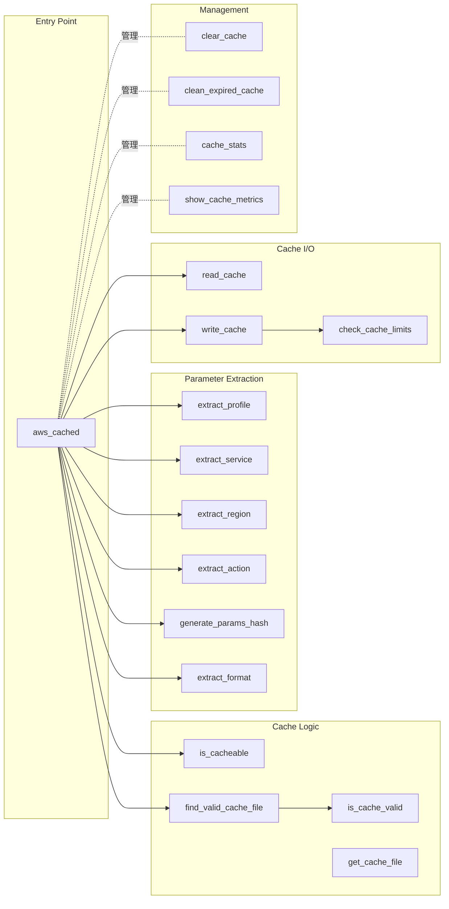

---

## キャッシュディレクトリ構造

### 階層構造

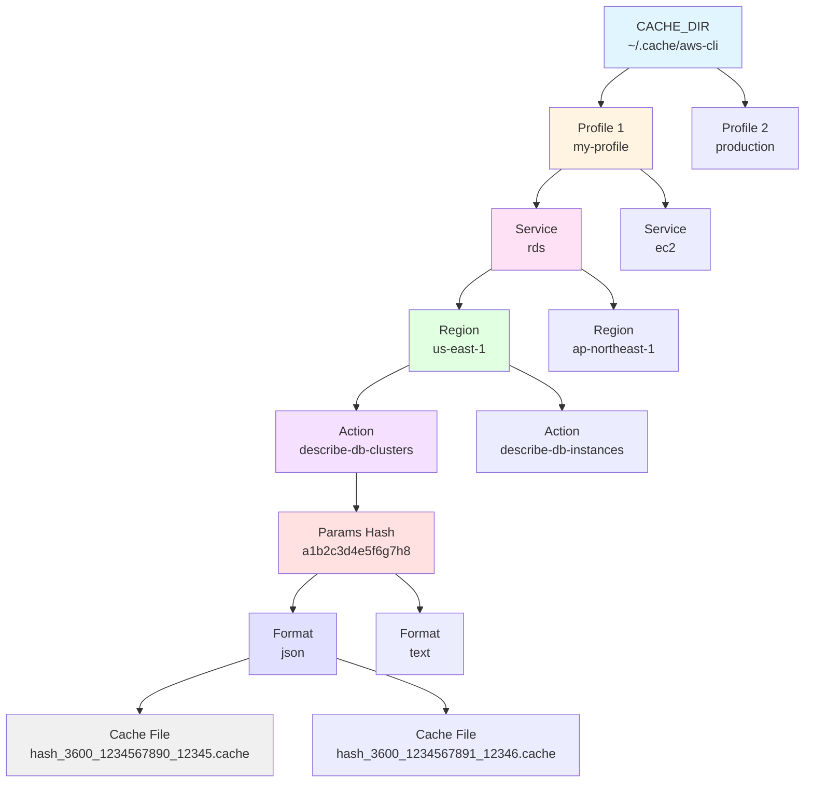

---

## 状態遷移図

### キャッシュファイルのライフサイクル

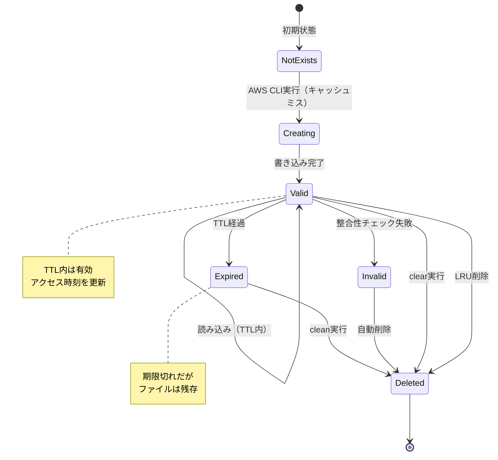

---

## 並行実行の仕組み

### アトミック書き込み

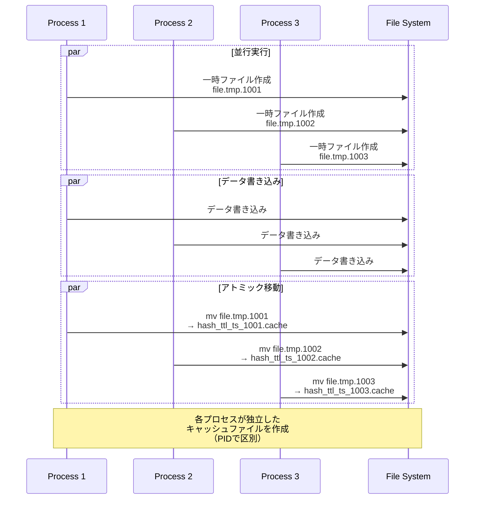

---

## LRU削除の仕組み

### サイズ制限とLRU削除

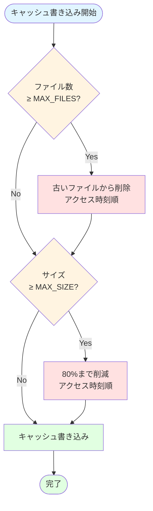

---

## キャッシュ判定フロー

### is_cacheable関数の処理

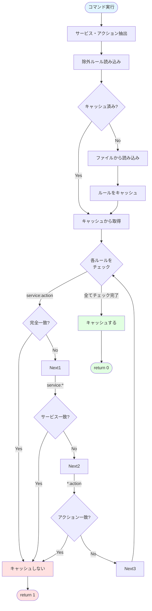

---

## 統計情報の記録

### メトリクス収集フロー

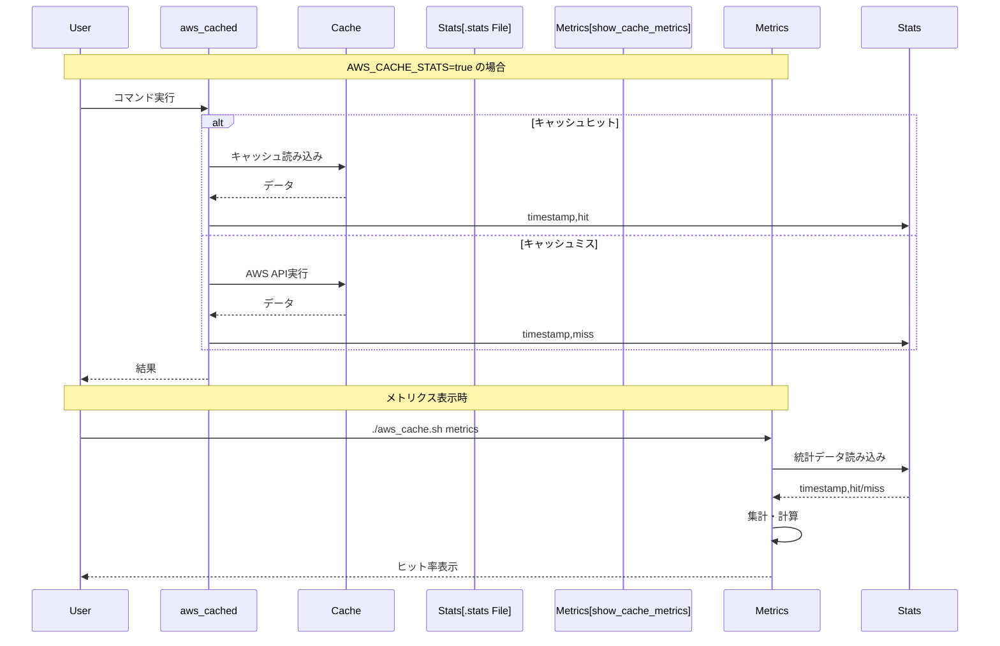

---

## エラーハンドリング

### エラー処理フロー

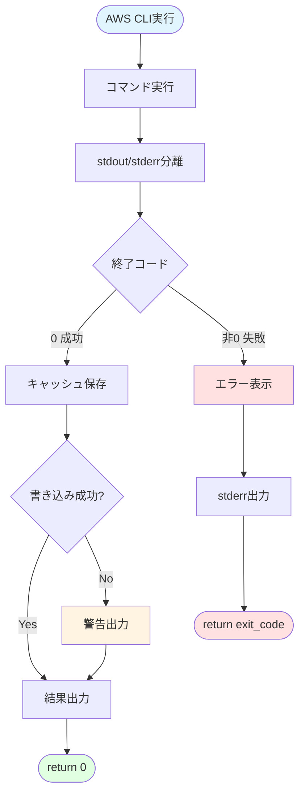

---

## 管理コマンドの構成

### コマンド処理フロー

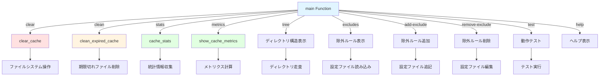

---

## パフォーマンス最適化

### 最適化ポイント

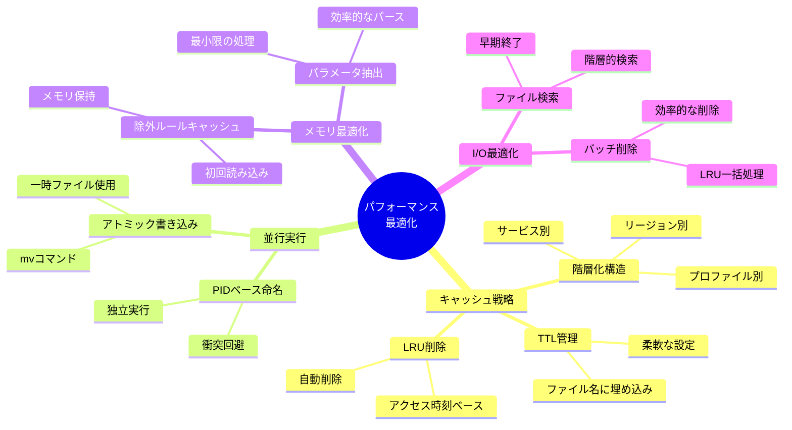

---

## セキュリティモデル

### セキュリティレイヤー

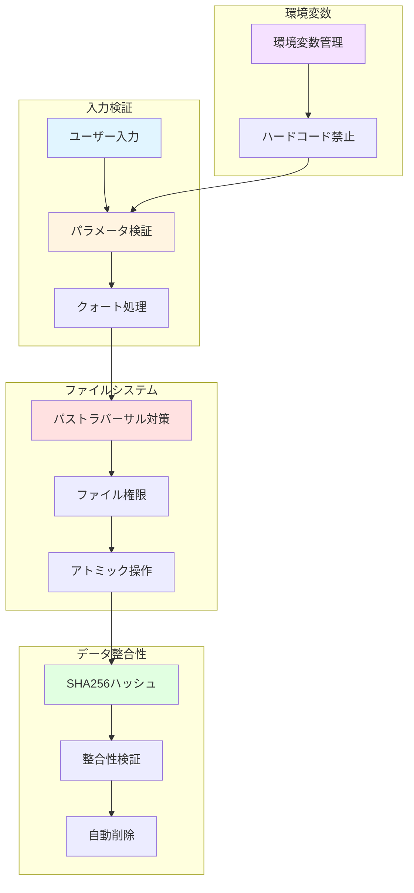

---

## まとめ

このアーキテクチャドキュメントでは、AWS CLI Cacheの内部構造を視覚的に説明しました。

### 主要な設計原則

1. **階層化**: 6層の論理的な構造
2. **並行性**: アトミック操作とPIDベース命名
3. **効率性**: LRU削除とメモリキャッシュ
4. **安全性**: 整合性検証とエラーハンドリング
5. **拡張性**: プラグイン可能な除外ルール

---

**作成者**: Kiro AI Assistant  
**作成日**: 2025年11月19日  
**バージョン**: 3.0.0
